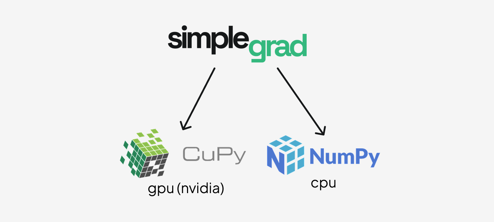
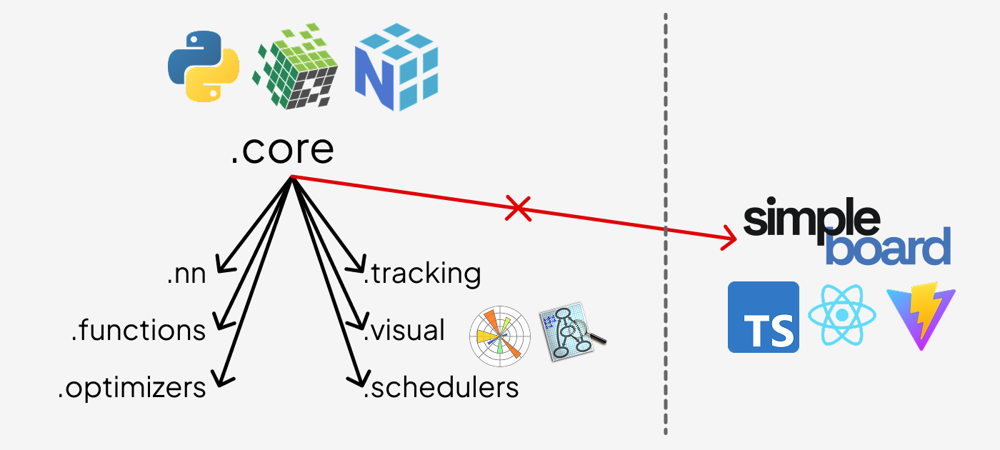

# Introduction

Simplegrad is the simplest complete deep learning framework you can actually use. Every part of the stack — from autograd to optimizers — is written in plain Python so that you can read the source and follow exactly what happens during training.

## Architecture

### Backends

Simplegrad runs on two compute backends depending on the device:



- **NumPy** — CPU compute. The default. No extra dependencies.
- **CuPy** — GPU compute on NVIDIA CUDA. Install CuPy and tensors created with `device="cuda:0"` use the GPU automatically.

The backend is selected per-tensor at creation time. The rest of the framework is backend-agnostic: every operation dispatches to `ctx.backend` (either `numpy` or `cupy`) at runtime.

### Package organization

`.core` is the foundation. Every other module — `functions`, `nn`, `optimizers`, `schedulers`, `track`, `visual` — imports from `.core`. `simpleboard` is the only exception: it is fully standalone and does not import from any other part of the package.



## Module overview

**`core/`** — The heart of the framework. `autograd.py` contains the `Tensor` class and the `Function` base class that every differentiable operation subclasses. The engine records the forward computation graph and walks it in reverse during `.backward()` to accumulate gradients via the chain rule. `core/` also defines `Module`, `Optimizer`, and `Scheduler` base classes used throughout the rest of the package.

**`functions/`** — A library of differentiable operations: element-wise math (`log`, `exp`, `sin`, `cos`), activations (`relu`, `tanh`, `sigmoid`, `softmax`), reductions (`sum`, `mean`), losses (`ce_loss`, `mse_loss`), 2D convolution, pooling, and shape transforms. Each operation subclasses `Function` and provides `forward` and `backward` static methods.

**`nn/`** — Neural network layers that wrap the functional operations behind a stateful `Module` interface. Includes `Linear`, `Conv2d`, `MaxPool2d`, `Dropout`, `Embedding`, `Flatten`, `Sequential`, activation layers, and loss layers. All layers expose a `.parameters()` dict used by optimizers.

**`optimizers/`** — Parameter update rules. `SGD` supports momentum and dampening. `Adam` maintains bias-corrected first and second moment estimates. Both accept any `Module` and call `.parameters()` to find what to update.

**`schedulers/`** — Learning rate schedules that wrap an `Optimizer` and call `.set_lr()` on each `.step()`. `LinearLR` interpolates linearly between a start and end rate; `ExponentialLR` decays by a fixed multiplicative factor; `CosineAnnealingLR` follows a cosine curve; `ReduceLROnPlateauLR` reduces when a monitored metric stalls.

**`track/`** — Experiment tracking backed by SQLite. `Tracker` lets you log scalar metrics at each training step, attach computation graphs to runs, and query historical results. Experiments are stored as `.db` files under a configurable directory.

**`visual/`** — Inline visualizations for notebooks. `graph()` renders the computation graph of any tensor as a Graphviz SVG. `plot()` and `scatter()` draw training metric line and scatter charts.

**`simpleboard/`** — A standalone web dashboard for exploring experiment runs. Launch it with `simpleboard` from the terminal. It does not import from the rest of the package.

## Full training example

```python
import simplegrad as sg

# Build a small classifier
model = sg.nn.Sequential(
    sg.nn.Linear(4, 16),
    sg.nn.ReLU(),
    sg.nn.Linear(16, 3),
)
loss_fn = sg.nn.CELoss()
optimizer = sg.opt.Adam(model, lr=1e-3)

# Toy data
x_train = sg.Tensor([[0.1, 0.2, 0.3, 0.4]] * 8, label="x")
y_train = sg.Tensor([[1, 0, 0]] * 8, label="y")

# Training loop
for step in range(200):
    optimizer.zero_grad()
    logits = model(x_train)
    loss = loss_fn(logits, y_train)
    loss.backward()
    optimizer.step()

    if step % 50 == 0:
        print(f"step {step}  loss {loss.values:.4f}")
```

## Lazy mode

By default simplegrad runs in eager mode: every operation executes immediately and returns a fully realized `Tensor`. Lazy mode defers execution until you call `.realize()`, which lets the engine fuse the whole computation into a single forward pass:

```python
with sg.lazy():
    a = sg.Tensor([1.0, 2.0])
    b = sg.Tensor([3.0, 4.0])
    c = a + b          # not computed yet — c.values is None
    d = sg.mean(c)     # also deferred

d.realize()            # executes the full graph in one shot
print(d.values)        # 3.5
```

You can also toggle modes globally:

```python
sg.set_mode("lazy")    # all subsequent ops are lazy
sg.set_mode("eager")   # back to default
```

## Experiment tracking

```python
from simplegrad.track import Tracker

tracker = Tracker("./experiments")
tracker.set_experiment("mnist")
run_id = tracker.start_run(name="baseline", config={"lr": 1e-3})

for step in range(100):
    # ... training step ...
    tracker.record("loss", loss.values.item(), step=step)

tracker.end_run()
```

## Computation graph visualization

```python
from simplegrad.visual import graph

x = sg.Tensor([1.0, 2.0], label="x")
y = sg.Tensor([3.0, 4.0], label="y")
z = sg.mean(x * y + x)

graph(z)   # renders an SVG in the notebook
```
